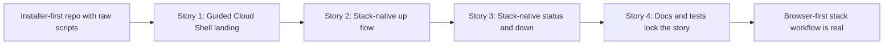

# Phase Contract: Phase 1 - Browser-First Stack Workflow

**Date**: 2026-04-01
**Feature**: `openclaw-gcp-cloud-shell-first`
**Phase Plan Reference**: `history/openclaw-gcp-cloud-shell-first/phase-plan.md`
**Based on**:
- `history/openclaw-gcp-cloud-shell-first/CONTEXT.md`
- `history/openclaw-gcp-cloud-shell-first/discovery.md`
- `history/openclaw-gcp-cloud-shell-first/approach.md`

---

## 1. What This Phase Changes

This phase turns the repo into something a person can realistically start from the browser instead of from a local terminal full of prior context. After it lands, the repo has an official Cloud Shell quickstart, a guided welcome path, and one stack-native command surface that lets an operator bring up OpenClaw, inspect the stack, and tear it down without re-describing template, router, or NAT names. The existing operator safety still matters just as much as before, but it is now hidden behind a simpler product story.

---

## 2. Why This Phase Exists Now

- This is the smallest believable slice of the feature because it proves the main promise: `Open in Cloud Shell -> up -> status -> down`.
- Recovery from missing local context only makes sense after the repo has a canonical stack contract and a primary stack-native command surface.
- If this phase were skipped, later work would be polishing an operator workflow that still feels raw and infrastructure-first.

---

## 3. Entry State

- The repo already knows how to provision or reuse a VM, gate readiness, hand off to the upstream installer, and destroy a named deployment safely.
- The current public story is still installer-first, with `scripts/openclaw-gcp/install.sh` and `scripts/openclaw-gcp/destroy.sh` exposed as raw entrypoints.
- There is no stack-native command surface, no Cloud Shell launch path, no current-stack convenience state, and no status command.
- Labels are not yet applied consistently to managed resources, and router/NAT ownership is still expressed only through raw names.

---

## 4. Exit State

- The repo publishes an official Open in Cloud Shell quickstart path that opens this repo and launches a repo-hosted tutorial and/or printed guidance so the guided welcome flow is immediately obvious using only officially supported Cloud Shell features.
- The repo exposes one stack-native command surface for Phase 1, with `welcome`, `up`, `status`, and `down` behavior that matches the approved UX.
- `up` requires an explicit stack name on first use, derives the managed raw resource names from that stack ID, applies the approved stack labels to labelable resources, records the current-stack convenience state in Cloud Shell, and delegates real bring-up to the existing install/provisioning engine.
- `status` shows a human-readable summary of the current or explicit stack, including stack identity, lifecycle, project/region/zone, derived resource names, and whether the expected managed resources exist.
- `down` resolves the same stack contract, defaults to the remembered current stack only in interactive Cloud Shell usage, requires an explicit stack in non-interactive usage, and delegates destructive work to `scripts/openclaw-gcp/destroy.sh` so the typed-confirmation and exact-target safeguards remain intact.
- The root README, runbook, and shell test suite all reflect the new browser-first story and fail if the published command surface drifts.

**Rule:** every exit-state line above is demonstrable by a docs walkthrough, script behavior, or test assertion.

---

## 5. Demo Walkthrough

A user lands on the repo README, clicks the Open in Cloud Shell button, and Cloud Shell opens into this repo with a repo-hosted tutorial or printed instructions that make the next action obvious without auto-provisioning anything. They run the repo-native welcome flow, choose a stack name, run the stack-native `up` flow, and OpenClaw comes up on GCP through the existing safe provisioning and install path underneath. They run `status` to see the current stack identity and derived resources, then run `down --dry-run` and a real `down`, where the familiar destroy confirmation guard still protects the actual teardown.

### Demo Checklist

- [ ] The README exposes an official Open in Cloud Shell path that opens this repo and points into the Phase 1 tutorial/printed welcome experience.
- [ ] The welcome path uses officially supported Cloud Shell features only, stays non-mutating, asks for a stack name, and leads the operator into the exact `up` flow without requiring raw resource names.
- [ ] `up` uses deterministic stack-derived names, persists current-stack convenience state, and delegates to the existing install/provisioning engine.
- [ ] `status` can explain the current or explicit stack in human-readable terms.
- [ ] `down --dry-run` and real `down` both use the same stack contract, and real interactive teardown still requires the existing destroy confirmation behavior.
- [ ] Docs and tests protect the new browser-first path from drifting back into an infrastructure-first story.

---

## 6. Story Sequence At A Glance

| Story | What Happens | Why Now | Unlocks Next | Done Looks Like |
|-------|--------------|---------|--------------|-----------------|
| Story 1: Land in Cloud Shell with a guided next step | The repo gains an official Cloud Shell launch path plus a non-mutating tutorial-backed welcome flow that makes the stack-native path obvious. | The browser landing must exist before the rest of the UX can matter. | Story 2 can connect that welcome flow to a real stack-native `up` command. | A user can reach the repo from the browser and see a guided Phase 1 path instead of raw script sprawl. |
| Story 2: Turn one stack name into a real `up` flow | A stack ID becomes the unit of ownership, raw names are derived automatically, labels/state are recorded, and `up` delegates to the existing install engine. | The main product value is not just landing in Cloud Shell; it is being able to bring up OpenClaw through a stack-native command. | Story 3 can use the same stack contract for inspection and teardown. | A first-time operator can name a stack once and use `up` without specifying template/router/NAT names. |
| Story 3: Make `down` and `status` speak the same stack language | The same stack contract powers human-readable status and safe teardown behavior. | The UX is not believable unless the same stack idea works after bring-up too. | Story 4 can freeze the published user story into docs and tests. | Operators can inspect and tear down a stack without falling back to raw infrastructure vocabulary. |
| Story 4: Lock the story into docs and tests | The README, runbook, and shell tests all protect the browser-first, stack-native story. | The phase is not real until the public story and regression surface both match the implementation. | Validation and execution can rely on a test-backed operator contract. | `make test` and dry-run docs examples keep the new primary flow honest. |

---

## 7. Phase Diagram

---

## 8. Out Of Scope

- Recovering a stack when the local current-stack pointer is missing or stale remains Phase 2 work.
- Day-2 commands like `ssh` and `logs` remain Phase 3 work.
- A hosted control plane, Cloud Shell custom image strategy, or migration away from Bash is explicitly out of scope.
- Multi-stack listing, lifecycle-policy UX beyond the default `persistent` label, and broader infra discovery remain later concerns.

---

## 9. Success Signals

- A newcomer can understand the repo’s main workflow from the browser-first docs alone.
- A first-time operator can bring up a named stack and later inspect or tear it down without supplying raw template/router/NAT names.
- Reviewers can see that the existing destroy safety posture still exists underneath the simpler `down` command.
- `make test` protects the new primary flow, including docs examples and stack-native wrapper behavior.

---

## 10. Failure / Pivot Signals

- If the official Cloud Shell feature set cannot support a credible guided welcome path for this repo, validating should force the smallest compliant landing repair before execution.
- If the repo cannot preserve a trustworthy stack contract for router/NAT without labels, validating should force a narrower Phase 1 ownership rule instead of bluffing durable discovery.
- If `down` cannot reuse the existing destroy guardrails while staying stack-native, the phase should stop and revisit the wrapper boundary rather than weakening safety.
- If the docs and tests cannot express the new primary flow clearly, the repo is not ready to treat this as the default operator story.

---

## 11. Validation Constraints

- Official Cloud Shell launch behavior for Phase 1 is constrained to documented parameters such as `cloudshell_git_repo`, `cloudshell_workspace`, `cloudshell_tutorial`, `cloudshell_print`, and optional editor/layout hints. The phase must not rely on undocumented launch-time command execution.
- Router and NAT remain deterministic companion resources of the labeled stack anchor in Phase 1. They are not independently discoverable by the same label contract because the current CLI path does not expose label flags there.
- The local Cloud Shell state file remains convenience state only. It may persist the current stack plus last-known project, region, and zone, but stack resolution must still fail closed if GCP-backed anchors disagree with local state.
