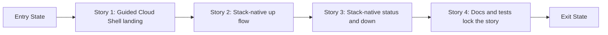

# Story Map: Phase 1 - Browser-First Stack Workflow

**Date**: 2026-04-01
**Phase Plan**: `history/openclaw-gcp-cloud-shell-first/phase-plan.md`
**Phase Contract**: `history/openclaw-gcp-cloud-shell-first/phase-1-contract.md`
**Approach Reference**: `history/openclaw-gcp-cloud-shell-first/approach.md`

---

## 1. Story Dependency Diagram

---

## 2. Story Table

| Story | What Happens In This Story | Why Now | Contributes To | Creates | Unlocks | Done Looks Like |
|-------|-----------------------------|---------|----------------|---------|---------|-----------------|
| Story 1: Land in Cloud Shell with a guided next step | The repo gains an official Cloud Shell launch path and a non-mutating tutorial-backed welcome flow that makes the Phase 1 operator path obvious. | The browser landing is the first moment of product value, so it must exist before deeper command behavior matters. | Exit-state line 1 | Launch URL/button contract, welcome asset(s), and a guided first-run entrypoint | Story 2 can connect the welcome path to a real stack-native `up` flow | A user can reach the repo from the browser and see a guided next action instead of raw script names |
| Story 2: Turn one stack name into a real `up` flow | A stack ID becomes the operator input, raw resource names are derived, labels and local state are recorded, and `up` delegates to the existing install engine. | The browser-first story is not believable until one stack can actually be brought up without infrastructure vocabulary. | Exit-state lines 2 and 3 | Shared stack helpers, dispatcher surface, `up` command behavior, and label/state contract | Story 3 can inspect and tear down the same stack contract | A user names a stack once and gets OpenClaw running without passing template/router/NAT flags |
| Story 3: Make `down` and `status` speak the same stack language | The same stack contract powers a human-readable status view and a safe stack-native teardown path. | A stack-native `up` alone is incomplete; the same ownership model must hold after bring-up too. | Exit-state lines 4 and 5 | `status` summary behavior, stack-aware `down`, and stack-to-destroy resolution rules | Story 4 can publish and freeze the final user story | A user can inspect the current stack and tear it down safely without re-describing raw resources |
| Story 4: Lock the story into docs and tests | The browser-first quickstart, wrapper docs, and shell tests all enforce the new primary operator story. | Without docs and regression coverage, the phase would remain a local implementation detail instead of a repo contract. | Exit-state line 6 | Updated README/runbook/tutorial wording plus wrapper and docs smoke coverage | Validating and execution can trust the published story | `make test` and the published docs both describe the same browser-first stack workflow |

---

## 3. Story Details

### Story 1: Land in Cloud Shell with a guided next step

- **What Happens In This Story**: the repo gets the official Cloud Shell launch surface and the non-mutating tutorial-backed welcome assets that set up the browser-first experience.
- **Why Now**: this story establishes the first-run product surface and de-risks the Cloud Shell-specific part of the feature before deeper wrapper behavior is layered in.
- **Contributes To**: exit-state line 1.
- **Creates**: an official launch URL/button strategy, a repo-hosted tutorial and/or printed quickstart asset, and the welcome flow entrypoint.
- **Unlocks**: Story 2 can plug the actual stack-native `up` flow into a real browser landing path.
- **Done Looks Like**: a user can open the repo in Cloud Shell and immediately see the guided Phase 1 path the project intends them to take without relying on undocumented launch-time command execution.
- **Candidate Bead Themes**:
  - define the official Cloud Shell landing asset, tutorial contract, and welcome script contract
  - wire the landing flow into repo-hosted quickstart material without mutating infrastructure

### Story 2: Turn one stack name into a real `up` flow

- **What Happens In This Story**: the repo gains a stack-native wrapper and shared stack helpers that turn one explicit stack ID into deterministic raw resource names, labels, convenience state, and a delegated `up` flow.
- **Why Now**: this is the first story where the product promise becomes operationally real, and later status/teardown behavior should reuse exactly the same stack contract.
- **Contributes To**: exit-state lines 2 and 3.
- **Creates**: the shared stack library, the wrapper command surface, the current-stack plus last-known-context state contract, and the `up` command path.
- **Unlocks**: Story 3 can consume the same naming, label, and current-stack state rules instead of inventing a second ownership model.
- **Done Looks Like**: a user can provide a stack ID once and run the real `up` flow without supplying template/router/NAT names manually.
- **Candidate Bead Themes**:
  - build stack naming, label, and local-state helpers plus the wrapper skeleton
  - implement `up` by mapping stack identity onto the existing install/provisioning engine

### Story 3: Make `down` and `status` speak the same stack language

- **What Happens In This Story**: the repo can explain and tear down the current or explicit stack using the same ownership model created in Story 2, with router/NAT handled as deterministic companions of labeled stack anchors.
- **Why Now**: Phase 1 is not credible if only bring-up is simplified; operators also need to understand what the tool owns and destroy it safely.
- **Contributes To**: exit-state lines 4 and 5.
- **Creates**: `status`, stack-aware `down`, and the resolution logic that bridges the stack contract into `destroy.sh`.
- **Unlocks**: Story 4 can publish and test the full user-facing workflow rather than just pieces of it.
- **Done Looks Like**: a user can run `status` and `down` without re-specifying the infrastructure that `up` created, while non-interactive destroy still requires explicit stack targeting and ambiguous stack resolution fails closed.
- **Candidate Bead Themes**:
  - implement human-readable `status` using local state plus GCP-backed stack anchors
  - implement stack-aware `down` that preserves the existing destroy safety gates

### Story 4: Lock the story into docs and tests

- **What Happens In This Story**: the README, runbook, Cloud Shell quickstart content, and shell test suite all move to the new primary story and enforce it.
- **Why Now**: publishing and verifying the new workflow should happen after the command behavior is stable enough to document honestly.
- **Contributes To**: exit-state line 6.
- **Creates**: public documentation, quickstart examples, and wrapper/docs smoke coverage.
- **Unlocks**: validating can assess the phase as a real operator slice instead of a hidden implementation.
- **Done Looks Like**: docs tell the same story as the code, and automated tests fail if the published stack-native quickstart drifts.
- **Candidate Bead Themes**:
  - rewrite root/readme/runbook narrative around the browser-first stack workflow
  - add tests for wrapper behavior and updated docs examples

---

## 4. Story Order Check

- [x] Story 1 is obviously first
- [x] Every later story builds on or de-risks an earlier story
- [x] If every story reaches "Done Looks Like", the phase exit state should be true

---

## 5. Story-To-Bead Mapping

> Fill this in after bead creation so validating and swarming can see how the narrative maps to executable work.

| Story | Beads | Notes |
|-------|-------|-------|
| Story 1: Land in Cloud Shell with a guided next step | `br-2hp` | `br-rfo` validated that this story must use official tutorial/print mechanics rather than undocumented launch-time command execution |
| Story 2: Turn one stack name into a real `up` flow | `br-33m`, `br-3sr` | `br-33m` defines naming, labels, and local state; `br-3sr` uses that contract to wire the real `up` flow and persist last-known project, region, and zone |
| Story 3: Make `down` and `status` speak the same stack language | `br-3n1`, `br-20x` | `br-b7f` validated router/NAT as deterministic companions, and `br-lgy` validated thin delegation into `destroy.sh` with fail-closed resolution |
| Story 4: Lock the story into docs and tests | `br-n2x`, `br-3am` | Docs follow the stabilized command surface, and smoke coverage lands last so it protects the final published story rather than an intermediate one |
