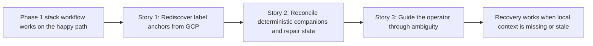

# Phase Contract: Phase 2 - Recovery When Context Is Missing

**Date**: 2026-04-01
**Feature**: `openclaw-gcp-cloud-shell-first`
**Phase Plan Reference**: `history/openclaw-gcp-cloud-shell-first/phase-plan.md`
**Based on**:
- `history/openclaw-gcp-cloud-shell-first/CONTEXT.md`
- `history/openclaw-gcp-cloud-shell-first/discovery.md`
- `history/openclaw-gcp-cloud-shell-first/approach.md`
- `history/openclaw-gcp-cloud-shell-first/phase-1-contract.md`

---

## 1. What This Phase Changes

This phase makes the stack-native workflow resilient when the local current-stack pointer is gone or stale. After it lands, a returning operator with a known project context can run the recovery-aware `status` flow, rediscover Phase 1 stacks from GCP label anchors, repair local convenience state only when the result is unambiguous, and then safely continue with the same `status` and `down` workflow instead of starting over from raw infrastructure names.

---

## 2. Why This Phase Exists Now

- Phase 1 proved that one stack can be brought up, inspected, and torn down through a browser-first flow, but it still depends too much on the happy path where the local state file is present and correct.
- The repo already chose labels as the durable ownership contract in `D5`, so the next practical step is to use those labels to recover from normal Cloud Shell realities like stale state, lost tabs, or later return sessions.
- Recovery deserves its own phase because it touches the same safety boundary as teardown: if the tool guesses wrong, it can point a user at the wrong stack.

---

## 3. Entry State

- Phase 1 is complete, and the repo already has:
  - an official Cloud Shell landing path
  - `welcome`, `up`, `status`, and `down`
  - a local convenience state file at `~/.config/openclaw-gcp/current-stack.env`
  - labeled instance/template anchors and deterministic router/NAT companion names
- The current wrapper still behaves like this:
  - `status` needs either `--stack-id` or `CURRENT_STACK_ID`
  - `down` needs either explicit `--stack-id` or a remembered current stack in interactive Cloud Shell
  - if local state is missing or stale, the tool fails closed rather than rediscovering from GCP
- The project context still matters:
  - this phase may rely on explicit `--project-id`, remembered `LAST_PROJECT_ID`, or current `gcloud` project context
  - this phase does not require cross-project guessing or GCP project creation

---

## 4. Exit State

- The wrapper has a recovery-aware status path that stays inside the existing Phase 1 command surface rather than introducing a hosted control plane or broad discovery workflow.
- When local current-stack state is missing or stale, and project context is known, `status` can rediscover candidate stacks from GCP using the durable label anchors on instances/templates.
- Candidate recovery is fail-closed and explicit:
  - if exactly one recoverable stack is found, `status` shows that stack and repairs local convenience state
  - if multiple recoverable stacks are found, the tool lists the candidates and requires explicit `--stack-id`
  - if no recoverable stack is found, the tool explains what context is missing or what the operator should check next
- Recovered stack handling preserves the Phase 1 ownership model:
  - instance/template labels remain the durable truth
  - router/NAT remain deterministic companions derived from the recovered stack ID
  - local state is repaired only after the recovered stack identity is trustworthy
- `down` remains conservative:
  - it may use an explicitly named stack or a repaired current stack
  - it must not silently guess among multiple candidate stacks during a destructive flow
- The docs and shell test suite cover the new reality:
  - missing current-state recovery
  - stale current-state recovery
  - ambiguous multi-stack recovery
  - safe handoff from recovered `status` into later `down`

**Rule:** every exit-state line above must be demonstrable by a wrapper run, a doc walkthrough, or a shell test assertion.

---

## 5. Demo Walkthrough

An operator returns to Cloud Shell later and the file `~/.config/openclaw-gcp/current-stack.env` is gone. They still know the project context, so they run `./bin/openclaw-gcp status --project-id hoangnb-openclaw`. The wrapper queries GCP label anchors, finds exactly one recoverable stack, prints the same human-readable summary as before, and repairs the local current-stack pointer. After that, the operator can run `./bin/openclaw-gcp down` in the same interactive Cloud Shell session and still get the existing Phase 1 destroy safety.

### Demo Checklist

- [ ] A missing `CURRENT_STACK_ID` no longer blocks `status` when project context is known and exactly one recoverable stack exists.
- [ ] A stale `CURRENT_STACK_ID` is detected as stale rather than treated as durable truth.
- [ ] Multiple candidate stacks never get auto-selected.
- [ ] Recovered stack state is written only after the wrapper can point at one trustworthy stack identity.
- [ ] `down` still refuses to guess across multiple stacks and continues to preserve the existing destroy guardrails.

---

## 6. Story Sequence At A Glance

| Story | What Happens | Why Now | Unlocks Next | Done Looks Like |
|-------|--------------|---------|--------------|-----------------|
| Story 1: Rediscover stack anchors from GCP | The wrapper can query labeled instance/template anchors inside one known project context and derive recovery candidates when local state is missing or stale. | Recovery starts with durable truth, not with local files or raw-name guessing. | Story 2 can reuse the recovered stack ID for deterministic companion handling and state repair. | `status` can find the right stack again when exactly one label-backed candidate exists. |
| Story 2: Reconcile unlabeled companion resources safely | Once a stack is recovered from anchors, the wrapper can reuse the existing deterministic router/NAT naming model and repair the local state only after the full stack contract is trustworthy. | Recovery is not believable unless the same stack identity still lines up with the rest of the managed resources and later `down` behavior. | Story 3 can explain and document the ambiguous cases instead of mixing contract repair with UX messaging. | A recovered stack behaves like a normal current stack again without pretending router/NAT are independently label-discovered. |
| Story 3: Guide the operator through ambiguity | Missing-state, stale-state, and multi-stack cases all produce clear operator guidance, and docs/tests protect the fail-closed recovery rules. | Recovery work is only safe if the tool explains exactly when it knows enough and when it refuses to choose. | Phase 3 can build nicer day-2 commands on a trustworthy recovery model. | The operator can tell the difference between “recovered,” “ambiguous,” and “not enough context,” and the repo tests those paths. |

---

## 7. Phase Diagram

---

## 8. Out Of Scope

- Creating new GCP projects or broad project bootstrap remains out of scope.
- Cross-project discovery across every project visible to the operator remains out of scope.
- Automatic selection among multiple candidate stacks remains out of scope.
- `ssh`, `logs`, or broader day-2 operator commands remain Phase 3 work.
- Replacing the Phase 1 stack model, wrapper shape, or destroy guardrails remains out of scope.

---

## 9. Success Signals

- A user can come back later, lose the local current-stack file, and still recover one stack safely from GCP labels.
- Stale local state is treated as convenience data that can be repaired, not as a durable source of truth.
- The tool never destroys or selects a stack automatically when multiple candidates exist.
- The operator can tell, in plain language, what the tool found and why it did or did not repair the current state.
- The shell test suite catches regressions in missing-state, stale-state, and ambiguity handling.

---

## 10. Failure / Pivot Signals

- If project-scoped label discovery cannot produce a trustworthy candidate set without overreaching into broad infra guessing, validating should narrow the recovery contract before execution.
- If instance/template anchors can disagree often enough that recovery becomes confusing or unsafe, validating should require a tighter reconciliation rule before implementation.
- If the easiest implementation path tries to make `down` rediscover and guess during destructive flows, validating should force the phase back toward a more conservative `status`-first repair model.
- If docs and tests cannot explain the ambiguity rules simply, the recovery surface is still too clever and should be simplified.

---

## 11. Validation Constraints

- Recovery must be project-scoped, not cross-project.
- Recovery must be label-anchor-first, not router/NAT-first.
- Router/NAT may remain deterministic companions in this phase, but the tool must not overclaim them as independently discovered durable truth.
- Automatic repair is allowed only when exactly one candidate stack is recoverable.
- Destructive flows must remain stricter than informational flows.
