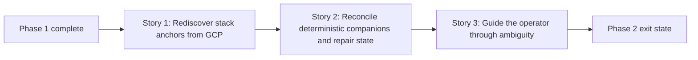

# Story Map: Phase 2 - Recovery When Context Is Missing

**Date**: 2026-04-01
**Phase Plan**: `history/openclaw-gcp-cloud-shell-first/phase-plan.md`
**Phase Contract**: `history/openclaw-gcp-cloud-shell-first/phase-2-contract.md`
**Approach Reference**: `history/openclaw-gcp-cloud-shell-first/approach.md`

---

## 1. Story Dependency Diagram

---

## 2. Story Table

| Story | What Happens In This Story | Why Now | Contributes To | Creates | Unlocks | Done Looks Like |
|-------|-----------------------------|---------|----------------|---------|---------|-----------------|
| Story 1: Rediscover stack anchors from GCP | The wrapper gains a project-scoped way to query labeled instance/template anchors, reconcile them into candidate stack IDs, and use that candidate set when local current-state is missing or stale. | Recovery must start with the durable truth chosen in Phase 1 instead of trying to infer ownership from local files or unlabeled resources. | Exit-state lines 1, 2, and 3 | Recovery candidate discovery helpers, anchor-reconciliation rules, and the exact-one-candidate recovery contract | Story 2 can reuse the recovered stack ID to restore the rest of the stack contract safely | `status` can find one recoverable stack from GCP labels when the local pointer is gone. |
| Story 2: Reconcile unlabeled companion resources safely | Once a stack candidate is recovered from labels, the wrapper can reuse deterministic router/NAT naming, repair local state carefully, and make the recovered stack behave like a normal current stack again. | Recovery is not credible until the recovered stack identity lines up with the rest of the Phase 1 ownership contract and later `down` behavior. | Exit-state lines 3, 4, and 5 | State-repair rules, deterministic companion reconciliation, and a safe bridge from recovered `status` into later `down` | Story 3 can explain the remaining edge cases instead of reopening the stack contract itself | A recovered stack can be inspected and then torn down through the existing Phase 1 rules without pretending router/NAT were label-discovered. |
| Story 3: Guide the operator through ambiguity | Missing-state, stale-state, no-match, and multi-stack cases all produce clear guidance, and docs/tests lock those fail-closed rules into the repo contract. | Recovery is only safe if the tool explains exactly when it knows enough and when it refuses to choose. | Exit-state lines 3, 5, and 6 | Operator-facing ambiguity messages, recovery docs, and regression coverage for safe/non-safe recovery paths | Phase 3 can add nicer day-2 workflows on top of a trustworthy recovery model | The operator can tell whether the tool recovered one stack, found several, or still needs more context, and the repo tests those cases. |

---

## 3. Story Details

### Story 1: Rediscover stack anchors from GCP

- **What Happens In This Story**: the wrapper learns how to discover Phase 1 stacks from the durable label anchors already written on instances/templates and turn those anchors into candidate stack IDs.
- **Why Now**: without a trustworthy candidate set, later state repair or operator guidance is just guesswork.
- **Contributes To**: exit-state lines 1, 2, and 3.
- **Creates**: project-scoped label queries, candidate stack reconciliation rules, and the exact-one-candidate recovery boundary.
- **Unlocks**: Story 2 can safely reuse the recovered stack ID instead of inventing a second identity system.
- **Done Looks Like**: when local state is missing and the project context is known, the wrapper can discover one recoverable stack from GCP labels or say clearly that recovery is ambiguous.
- **Candidate Bead Themes**:
  - spike the safest project-scoped label discovery contract and exact-one-candidate auto-repair rule
  - implement candidate discovery helpers and recovery-aware `status`

### Story 2: Reconcile unlabeled companion resources safely

- **What Happens In This Story**: a recovered stack ID is pushed back through the same deterministic resource naming model used in Phase 1, and the wrapper repairs local state only after the recovered stack contract is trustworthy enough to reuse.
- **Why Now**: the operator should not recover just the label anchors and then immediately fall back into a different workflow for router/NAT or later `down`.
- **Contributes To**: exit-state lines 3, 4, and 5.
- **Creates**: deterministic companion reconciliation during recovery, repaired local state semantics, and a safe handoff from recovered `status` into later teardown.
- **Unlocks**: Story 3 can focus on ambiguity handling, docs, and tests rather than changing the recovery contract again.
- **Done Looks Like**: after one unambiguous recovery, the current-stack pointer is repaired and the recovered stack behaves like a normal current stack again.
- **Candidate Bead Themes**:
  - implement repaired-state write rules and conservative handoff into existing `down`
  - keep router/NAT under deterministic-name rules instead of widening discovery claims

### Story 3: Guide the operator through ambiguity

- **What Happens In This Story**: stale current-state, no-match, and multi-stack situations all produce plain-language guidance, and docs/tests freeze that contract so later phases do not accidentally make recovery unsafe.
- **Why Now**: the recovery model is not trustworthy until the repo makes the unsafe cases just as explicit as the happy path.
- **Contributes To**: exit-state lines 3, 5, and 6.
- **Creates**: ambiguity/error messaging, recovery docs, and shell coverage for missing/stale/ambiguous flows.
- **Unlocks**: Phase 3 can add richer day-2 commands without re-litigating how recovery safety works.
- **Done Looks Like**: the operator can distinguish “recovered,” “multiple candidates,” and “not enough context” immediately, and the test suite proves those branches.
- **Candidate Bead Themes**:
  - publish recovery guidance in docs and status/down messaging
  - add shell coverage for missing-state, stale-state, and ambiguity cases

---

## 4. Story Order Check

- [x] Story 1 is obviously first
- [x] Every later story builds on or de-risks an earlier story
- [x] If every story reaches "Done Looks Like", the phase exit state should be true

---

## 5. Story-To-Bead Mapping

> Fill this in after bead creation so validating and swarming can see how the narrative maps to executable work.

| Story | Beads | Notes |
|-------|-------|-------|
| Story 1: Rediscover stack anchors from GCP | `br-3ap`, `br-33v` | `br-3ap` validates the exact-one-candidate recovery contract before `br-33v` implements recovery-aware `status` |
| Story 2: Reconcile unlabeled companion resources safely | `br-1as` | This bead keeps router/NAT deterministic, repairs local state only after unambiguous recovery, and preserves the conservative `down` boundary |
| Story 3: Guide the operator through ambiguity | `br-2ns`, `br-m1s` | `br-2ns` publishes the operator-facing ambiguity rules, and `br-m1s` freezes them in mocked shell coverage |
