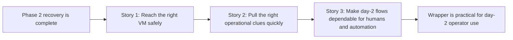

# Phase Contract: Phase 3 - Day-2 Operator Ergonomics

**Date**: 2026-04-02
**Feature**: `openclaw-gcp-cloud-shell-first`
**Phase Plan Reference**: `history/openclaw-gcp-cloud-shell-first/phase-plan.md`
**Based on**:
- `history/openclaw-gcp-cloud-shell-first/CONTEXT.md`
- `history/openclaw-gcp-cloud-shell-first/discovery.md`
- `history/openclaw-gcp-cloud-shell-first/approach.md`
- `history/openclaw-gcp-cloud-shell-first/phase-2-contract.md`

---

## 1. What This Phase Changes

This phase turns the stack wrapper from “good for first run and safe recovery” into “good enough for normal day-2 operator use.” After it lands, an operator who already has a stack can stay inside `./bin/openclaw-gcp` to open a shell on the right VM, pull the most relevant remote logs, and hand automation a richer `status --json` contract instead of rebuilding raw `gcloud compute ssh` and ad hoc log commands by hand.

---

## 2. Why This Phase Exists Now

- Phase 1 made the browser-first happy path real.
- Phase 2 made that stack identity recoverable when local context is missing or stale.
- Now that stack selection and recovery are trustworthy, the next practical improvement is to keep day-2 inspection work inside the same stack-native product surface.
- This phase is intentionally still thin: it should expose the best existing SSH and log seams already present in the repo rather than inventing a control plane or replacing the lower-level scripts.

---

## 3. Entry State

- Phase 2 is complete, and the repo already has:
  - a stack-native wrapper at `bin/openclaw-gcp`
  - `welcome`, `up`, `status`, and `down`
  - durable stack ownership anchored on labeled instance/template resources
  - recovery-aware `status` plus repaired local convenience state
- The lower-level day-2 primitives already exist in pieces:
  - `install.sh` already builds safe IAP SSH commands
  - `install.sh` already defines the remote readiness and installer log locations
  - `bootstrap-openclaw.sh` already documents the current gateway container log surface
  - `status --json` already exists but is still thin
- The wrapper still lacks:
  - a first-class `ssh` command
  - a first-class `logs` command
  - a richer machine-readable `status --json` contract for scripting

---

## 4. Exit State

- The wrapper exposes a stack-aware `ssh` command:
  - it accepts either an explicit `--stack-id` or the current/recovered stack under the same Phase 1/2 rules
  - it resolves project/region/zone from the same stack contract
  - it verifies the labeled instance/template anchors before opening a shell
  - it preserves the internal-only plus IAP SSH posture instead of introducing a weaker access path
- The wrapper exposes a stack-aware `logs` command:
  - it only offers known, documented log sources
  - it uses the same stack resolution and anchor verification model as `ssh`
  - it explains clearly when a requested log source is unavailable instead of guessing
- `status --json` becomes a more useful automation contract:
  - it includes the recovery outcome details that humans already see
  - it stays additive and stable rather than changing the default human-readable experience
- Docs and mocked shell coverage describe and protect the new day-2 surface:
  - `ssh`
  - `logs`
  - richer `status --json`

**Rule:** every exit-state line above must be demonstrable by a wrapper run, a doc walkthrough, or a shell test assertion.

---

## 5. Demo Walkthrough

An operator returns to Cloud Shell after a successful `up` or a recovered `status` run. They run `./bin/openclaw-gcp ssh` and land on the right VM without rebuilding a `gcloud compute ssh` command. They run `./bin/openclaw-gcp logs --source install --tail 100` to inspect the upstream installer transcript, then `./bin/openclaw-gcp logs --source gateway --tail 100` to inspect the running gateway logs. Finally, a script runs `./bin/openclaw-gcp status --json` and receives a richer machine-readable view of the same stack, recovery, and resource contract that humans see in normal `status`.

### Demo Checklist

- [ ] `ssh` resolves the intended stack through the existing Phase 1/2 rules instead of bypassing stack identity.
- [ ] `ssh` still refuses to proceed when anchor verification fails.
- [ ] `logs` exposes only known sources and stays honest when one is not available.
- [ ] `status --json` includes richer recovery and state fields without weakening the default human-readable summary.
- [ ] Docs and tests describe the same contract the commands actually implement.

---

## 6. Story Sequence At A Glance

| Story | What Happens | Why Now | Unlocks Next | Done Looks Like |
|-------|--------------|---------|--------------|-----------------|
| Story 1: Reach the right VM safely | The wrapper gains a first-class `ssh` command that reuses the existing stack resolution and anchor verification model before opening an IAP-backed shell. | Day-2 ergonomics start with getting the operator onto the right machine without rebuilding raw commands or bypassing safety. | Story 2 can reuse the same remote-access contract for logs instead of inventing a second path. | An operator can run `./bin/openclaw-gcp ssh` and land on the correct VM only when the stack contract is trustworthy. |
| Story 2: Pull the right operational clues quickly | The wrapper gains a first-class `logs` command that surfaces the most relevant remote logs through named, documented sources. | Once the wrapper can reach the right VM safely, the next practical operator need is to inspect what happened without remembering remote paths or docker log incantations. | Story 3 can freeze the automation and documentation contract around real commands instead of a moving target. | An operator can fetch readiness, install, bootstrap, or gateway logs through stack-aware wrapper commands. |
| Story 3: Make day-2 flows dependable for humans and automation | The repo hardens `status --json`, explains the new commands clearly, and adds shell coverage so the wrapper remains scriptable and trustworthy. | The new day-2 surface is only useful if humans understand it and automation can rely on it without brittle parsing. | Review and ship readiness. | The wrapper exposes a richer machine-readable contract, the docs teach the day-2 workflow clearly, and the mocked shell suite locks the behavior down. |

---

## 7. Phase Diagram

---

## 8. Out Of Scope

- Multi-stack listing or cross-project browsing remains out of scope.
- Arbitrary remote command execution UX beyond the minimal `ssh` surface remains out of scope unless it falls out naturally from the existing wrapper pattern.
- Replacing the current lower-level install or destroy engines remains out of scope.
- Hosted log aggregation or a control plane remains out of scope.
- New lifecycle operations beyond the current stack workflow remain out of scope.

---

## 9. Success Signals

- An operator can stay inside `./bin/openclaw-gcp` for normal inspection tasks after bring-up or recovery.
- The wrapper reduces day-2 command reconstruction without weakening stack safety.
- Scripts can rely on a better `status --json` contract without needing to scrape the human-readable summary.
- Docs explain which log sources exist, what they mean, and what still remains fail-closed.

---

## 10. Pivot Signals

- If `ssh` cannot preserve the current stack safety boundary without awkward or misleading behavior, validating should force a narrower contract before implementation.
- If the repo cannot point to a stable, truthful set of log sources, validating should reduce the logs surface instead of bluffing completeness.
- If richer `status --json` would require breaking the current human-first `status` design, the phase should narrow to additive fields only.

---

## 11. Validation Constraints

- `ssh` and `logs` must reuse the existing stack identity and anchor verification rules rather than adding a bypass path.
- Remote access must stay within the existing IAP-backed operator posture.
- Log sources must be explicit, named, and grounded in already-documented repo behavior.
- `status --json` should grow additively and remain consistent with the human-readable `status` output.

