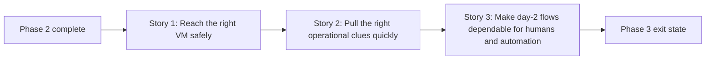

# Story Map: Phase 3 - Day-2 Operator Ergonomics

**Date**: 2026-04-02
**Phase Plan**: `history/openclaw-gcp-cloud-shell-first/phase-plan.md`
**Phase Contract**: `history/openclaw-gcp-cloud-shell-first/phase-3-contract.md`
**Approach Reference**: `history/openclaw-gcp-cloud-shell-first/approach.md`

---

## 1. Story Dependency Diagram

---

## 2. Story Table

| Story | What Happens In This Story | Why Now | Contributes To | Creates | Unlocks | Done Looks Like |
|-------|-----------------------------|---------|----------------|---------|---------|-----------------|
| Story 1: Reach the right VM safely | The wrapper adds a first-class `ssh` command that resolves the intended stack and verifies the live instance anchor before opening an IAP-backed shell. | There is no believable day-2 operator surface until the wrapper can reach the right VM without rebuilding raw commands or weakening safety. | Exit-state lines 1 and 4 | A stack-aware `ssh` contract and the guardrails around it | Story 2 can reuse the same remote-access contract for logs | `./bin/openclaw-gcp ssh` reaches the right VM only when the instance anchor verifies and any present template anchor still agrees. |
| Story 2: Pull the right operational clues quickly | The wrapper adds a first-class `logs` command for the named remote log sources the repo already supports: `readiness`, `install`, `bootstrap`, and `gateway`. | Once an operator can reach the right VM safely, the next practical job is pulling useful logs without remembering remote paths or container names. | Exit-state lines 2 and 4 | A stack-aware `logs` command and a clear named-source contract | Story 3 can document and automate a stable day-2 surface instead of a moving one | An operator can fetch the right remote logs through the wrapper with predictable, documented sources and clear fail-closed errors for anything else. |
| Story 3: Make day-2 flows dependable for humans and automation | The wrapper hardens `status --json`, the docs explain the new day-2 commands, and the shell suite freezes the contract. | The new day-2 surface is only trustworthy if automation can rely on it and humans can understand it quickly. | Exit-state lines 3 and 4 | A richer JSON contract, advanced docs, and regression coverage | Review and ship readiness | Humans and scripts can both rely on the wrapper for day-2 inspection. |

---

## 3. Story Details

### Story 1: Reach the right VM safely

- **What Happens In This Story**: the wrapper learns how to open an IAP-backed shell against the current, explicit, or exact-one recovered stack while preserving the existing stack-resolution behavior already used by `status`.
- **Why Now**: if the wrapper cannot reliably reach the intended VM, later log and automation work would be layered on top of an untrustworthy foundation.
- **Contributes To**: exit-state lines 1 and 4.
- **Creates**: a safe `ssh` surface, clarified remote-access rules, and a reusable remote-access contract for later log retrieval.
- **Unlocks**: Story 2 can fetch remote logs through the same stack-aware access path instead of inventing a parallel resolution model.
- **Done Looks Like**: an operator can run `./bin/openclaw-gcp ssh` or `./bin/openclaw-gcp ssh --stack-id <id>` and land on the right VM only after the wrapper verifies the labeled instance anchor, rejects template mismatches when present, and stays on the IAP-backed access path.
- **Candidate Bead Themes**:
  - spike the shared day-2 remote-access contract
  - implement stack-aware `ssh`

### Story 2: Pull the right operational clues quickly

- **What Happens In This Story**: the wrapper adds a named `logs` surface for the most useful remote sources already implied by the repo’s install and runtime contracts: `readiness`, `install`, `bootstrap`, and `gateway`.
- **Why Now**: after safe remote access exists, the most common next need is understanding what happened during readiness, install, bootstrap, or runtime without reconstructing raw commands manually.
- **Contributes To**: exit-state lines 2 and 4.
- **Creates**: a truthful log-source contract, stack-aware log retrieval, and failure messaging for unsupported or unavailable sources.
- **Unlocks**: Story 3 can document and test real operator workflows instead of hypothetical ones.
- **Done Looks Like**: an operator can run a logs command against the current, explicit, or exact-one recovered stack and get one of the four supported sources they asked for or a clear fail-closed explanation.
- **Candidate Bead Themes**:
  - implement `logs` using named remote sources and the shared stack-access contract

### Story 3: Make day-2 flows dependable for humans and automation

- **What Happens In This Story**: the wrapper strengthens `status --json`, the docs teach the day-2 workflow clearly, and the mocked shell harness locks the new contract into regression coverage.
- **Why Now**: the new commands only become dependable once both humans and scripts can rely on the same explicit contract.
- **Contributes To**: exit-state lines 3 and 4.
- **Creates**: a richer JSON contract, advanced docs, and shell coverage for `ssh`, `logs`, and day-2 status behavior.
- **Unlocks**: review and ship readiness without reopening command-surface ambiguity.
- **Done Looks Like**: the docs match the actual wrapper behavior, `status --json` is meaningfully richer, and tests fail if future edits drift from the day-2 contract.
- **Candidate Bead Themes**:
  - extend `status --json` with richer recovery and state fields
  - publish day-2 docs and examples
  - add mocked shell coverage for `ssh`, `logs`, and richer JSON output

---

## 4. Story Order Check

- [x] Story 1 is obviously first
- [x] Every later story builds on or de-risks an earlier story
- [x] If every story reaches "Done Looks Like", the phase exit state should be true

---

## 5. Story-To-Bead Mapping

> Fill this in after bead creation so validating and swarming can see how the narrative maps to executable work.

| Story | Beads | Notes |
|-------|-------|-------|
| Story 1: Reach the right VM safely | `br-1ca`, `br-202` | `br-1ca` validates the shared remote-access contract before `br-202` adds the first-class `ssh` command |
| Story 2: Pull the right operational clues quickly | `br-1er` | `br-1er` reuses the validated stack-access contract to add named remote log retrieval |
| Story 3: Make day-2 flows dependable for humans and automation | `br-1ja`, `br-17y`, `br-dra` | `br-1ja` strengthens `status --json`, then `br-17y` and `br-dra` publish and protect the final day-2 contract |
