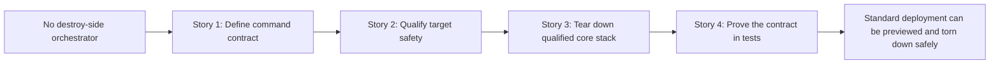

# Phase Contract: Phase 1 - Safely Remove The Standard Deployment

**Date**: 2026-03-31
**Feature**: `openclaw-gcp-destroy-script`
**Phase Plan Reference**: `history/openclaw-gcp-destroy-script/phase-plan.md`
**Based on**:
- `history/openclaw-gcp-destroy-script/CONTEXT.md`
- `history/openclaw-gcp-destroy-script/discovery.md`
- `history/openclaw-gcp-destroy-script/approach.md`

---

## 1. What This Phase Changes

This phase gives the repo a real destroy-side companion to `install.sh` for the standard OpenClaw deployment. After it lands, an operator can run one command, preview exactly which default stack resources will be deleted, type an explicit confirmation, and let the tool attempt teardown of the VM, template, NAT, and router in a controlled order. If anything fails, the operator gets a final summary that shows what was cleaned up and what still needs manual work.

---

## 2. Why This Phase Exists Now

- This is the smallest believable version of the destroy feature because it closes the main operational loop for the standard installer-managed deployment.
- Optional extras like snapshot policies and machine images add more destructive surface area, so they should wait until the core stack teardown contract is already trustworthy.
- If this phase were skipped, later work would pile optional behavior on top of an unproven destructive base.

---

## 3. Entry State

- The repo has a primary install-side entrypoint at `scripts/openclaw-gcp/install.sh`, but no destroy-side orchestrator.
- The standard OpenClaw deployment shape is defined implicitly by create-side scripts: VM instance, regional template, Cloud NAT, and Cloud Router.
- The shell test harness can already mock `gcloud` commands and verify user-facing command contracts, but it has no destroy-flow coverage yet.

---

## 4. Exit State

- `scripts/openclaw-gcp/destroy.sh` exists and can render a dry-run delete plan for the standard installer stack using explicit resource names.
- Interactive real runs require a typed confirmation unless the caller passes `--yes`, and the command enforces exact-name safety checks before deletion starts.
- Phase 1 has a validated disk-safety invariant: the core teardown path only proceeds when `gcloud compute instances describe ... --flatten='disks[]' --format='value(disks.boot,disks.autoDelete)'` returns exactly one row and that row is `true/true` after case-normalization; any additional attached disk or a sole disk that fails either predicate causes qualification to fail before deletion with manual guidance.
- Phase 1 has validated infra qualification predicates: the target template must expose the current startup contract metadata through `gcloud compute instance-templates describe ... --flatten='properties.metadata.items[]' --format='value(properties.metadata.items.key,properties.metadata.items.value)'`, the target router must belong to the requested network through `gcloud compute routers describe ... --format='value(network.basename())'`, and the target NAT must exist under that router with `AUTO_ONLY` plus `ALL_SUBNETWORKS_ALL_IP_RANGES` through `gcloud compute routers nats describe ... --format='value(natIpAllocateOption,sourceSubnetworkIpRangesToNat)'`; otherwise qualification fails before deletion with manual guidance.
- The destroy flow attempts the standard stack teardown in dependency-aware order and exits with a clear per-resource summary when all succeeds or when some deletions fail.
- `tests/openclaw-gcp/test.sh` proves the Phase 1 contract, including parser behavior, confirmation behavior, dry-run rendering, qualification failure fixtures, command order, and partial-failure reporting.

**Rule:** every exit-state line above is demonstrable by a script run or test assertion.

---

## 5. Demo Walkthrough

An operator runs `bash scripts/openclaw-gcp/destroy.sh --project-id hoangnb-openclaw --instance-name oc-main --template-name oc-template --router-name oc-router --nat-name oc-nat --dry-run` and sees the exact core-stack delete plan without mutating anything. They rerun without `--dry-run`, the script prints the plan again, requires the typed confirmation token, then attempts the teardown in order and finishes with a summary that either reports the standard deployment fully removed or identifies the exact leftover resource names for manual cleanup.

### Demo Checklist

- [ ] Dry-run shows the standard stack resource plan and rendered delete commands.
- [ ] Real interactive run requires the typed confirmation token before deleting anything.
- [ ] A target with more than one attached disk, or with a sole disk missing `boot=true` or `autoDelete=true`, fails during qualification before any destructive command runs.
- [ ] A target whose template metadata, router network, or NAT settings fall outside the explicit Phase 1 predicates fails during qualification before any destructive command runs.
- [ ] Success and partial-failure runs both end with a per-resource summary that matches what happened.

---

## 6. Story Sequence At A Glance

| Story | What Happens | Why Now | Unlocks Next | Done Looks Like |
|-------|--------------|---------|--------------|-----------------|
| Story 1: Define the destroy command contract | The repo gets a discoverable `destroy.sh` entrypoint with explicit flags, dry-run output, and typed confirmation behavior. | Operators need to understand and trust the command before any delete logic is worth adding. | Core teardown execution can plug into a stable CLI surface. | A dry-run and confirmation-only path can be shown without performing deletion. |
| Story 2: Qualify the target for safe teardown | The command checks the exact Phase 1 predicates for disks, template metadata, router network, and NAT mode before any delete command runs. | The destructive path should not begin until the target shape is proven safe enough for Phase 1. | The execution path can assume it is operating on a qualified standard deployment. | A mismatched target fails before deletion, and a valid target passes a clear qualification gate. |
| Story 3: Tear down the qualified core stack | The command performs best-effort deletion for instance, template, NAT, and router and records per-resource outcomes. | Once qualification is trustworthy, the main feature value is executing the real teardown. | Tests can verify the actual destructive sequence and mixed-success reporting. | The script can attempt a full standard-stack teardown and print a truthful outcome summary. |
| Story 4: Prove the contract in tests | The shell harness covers parser, qualification failures, dry-run, confirmation, delete ordering, and partial-failure behavior for Phase 1. | Destructive infrastructure tooling is not believable without automated contract coverage. | Phase 2 can extend the command with optional extras confidently. | `make test` includes destroy-flow coverage that protects the Phase 1 operator story. |

---

## 7. Phase Diagram

---

## 8. Out Of Scope

- Snapshot policy, machine image, and clone-specific cleanup flags remain for Phase 2.
- Final README and runbook updates remain for Phase 3.
- Broad resource discovery or deletion of custom/shared infrastructure remains explicitly out of scope.

---

## 9. Success Signals

- A dry-run of `destroy.sh` makes the planned standard-stack teardown obvious to a human operator.
- Real runs are blocked by typed confirmation unless `--yes` is supplied.
- Unexpected attached-disk shapes fail before deletion begins according to the exact Phase 1 predicates.
- Template/router/NAT contract mismatches fail before deletion begins according to the exact Phase 1 predicates.
- Reviewers and UAT can confirm that the command reports partial failures honestly instead of stopping silently or claiming full success.
- `make test` protects the full Phase 1 contract.

---

## 10. Failure / Pivot Signals

- If the team cannot enforce the exact attached-disk predicates (`one disk`, `boot=true`, `autoDelete=true`) cleanly, validating should force a narrower Phase 1 contract before execution.
- If template metadata, router network ownership, or NAT mode cannot be checked well enough to enforce the explicit infra predicates, execution should pivot to a stricter deletion scope instead of bluffing safety.
- If the script cannot provide a truthful end summary under mixed-success deletion outcomes, later phases should not proceed until the reporting model is redesigned.
