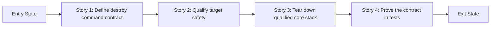

# Story Map: Phase 1 - Safely Remove The Standard Deployment

**Date**: 2026-03-31
**Phase Plan**: `history/openclaw-gcp-destroy-script/phase-plan.md`
**Phase Contract**: `history/openclaw-gcp-destroy-script/phase-1-contract.md`
**Approach Reference**: `history/openclaw-gcp-destroy-script/approach.md`

---

## 1. Story Dependency Diagram

---

## 2. Story Table

| Story | What Happens In This Story | Why Now | Contributes To | Creates | Unlocks | Done Looks Like |
|-------|-----------------------------|---------|----------------|---------|---------|-----------------|
| Story 1: Define destroy command contract | The repo gets the destroy entrypoint, flag surface, dry-run preview, and typed-confirmation guardrail. | A destructive command must be understandable before it is powerful. | Exit-state lines 1 and 2 | `destroy.sh` CLI skeleton and a stable operator contract | Story 2 can implement real deletion behind that contract | A user can preview the core stack plan and hit the confirmation gate without executing deletes |
| Story 2: Qualify the target for safe teardown | The command inspects the named standard-stack resources and applies exact predicates: one boot+autoDelete disk, current startup-contract metadata on the template, requested-network ownership on the router, and expected NAT mode. | Safety qualification needs to stand on its own before the delete engine is allowed to run. | Exit-state lines 2 and 3 | Qualification rules, target-shape checks, and manual-fail guidance | Story 3 can assume it is operating on a qualified standard deployment | A mismatched target fails before deletion, while a valid target passes a visible qualification gate |
| Story 3: Tear down the qualified core stack | The command deletes the qualified standard stack in dependency order and keeps going after partial failures. | Once safety qualification exists, the main product value is executing the real teardown. | Exit-state lines 3 and 4 | Deletion ordering, result collection, and final outcome summary | Story 4 can verify the real destructive flow | The standard stack can be deleted in dependency-aware order with a truthful final summary and non-zero partial-failure exit |
| Story 4: Prove the contract in tests | The mock shell suite covers the new destructive contract with specific qualification and failure fixtures. | The destroy flow is not trustworthy until regressions are automated. | Exit-state line 5 | Destroy-specific test cases and mock branches | Phase 2 can extend the command with confidence | `make test` protects parser, qualification failures, dry-run, confirmation, ordering, and failure-summary behavior |

---

## 3. Story Details

### Story 1: Define destroy command contract

- **What Happens In This Story**: `scripts/openclaw-gcp/destroy.sh` is introduced with the exact core-stack flags, help text, dry-run mode, typed confirmation behavior, and summary preamble that operators will see before real deletion.
- **Why Now**: a destructive command needs a stable and understandable outer contract before the inner delete sequence is added.
- **Contributes To**: exit-state lines 1 and 2.
- **Creates**: the command surface, input validation rules, and the human-readable delete plan format.
- **Unlocks**: Story 2 can attach actual resource inspection and deletion logic to a settled CLI.
- **Done Looks Like**: a dry-run and confirmation-path execution prove the command surface without mutating infrastructure.
- **Candidate Bead Themes**:
  - scaffold `destroy.sh` help, parser, and typed confirmation gate
  - render the standard-stack delete plan in dry-run and pre-delete summaries

### Story 2: Qualify the target for safe teardown

- **What Happens In This Story**: the command resolves the standard stack resource set and proves it is safe enough for Phase 1 by enforcing exact-name ownership checks and these validated inspection predicates before deletion: `gcloud compute instances describe` must yield exactly one `boot/autoDelete` disk row of `true/true`, `gcloud compute instance-templates describe` must yield the current startup-contract metadata, `gcloud compute routers describe` must yield the requested network, and `gcloud compute routers nats describe` must yield `AUTO_ONLY` plus `ALL_SUBNETWORKS_ALL_IP_RANGES`.
- **Why Now**: qualification needs to be separate from execution so validating and implementation can reason about safety independently from delete-order mechanics.
- **Contributes To**: exit-state lines 2 and 3.
- **Creates**: qualification rules, target-shape checks, and pre-delete manual guidance.
- **Unlocks**: Story 3 can focus purely on executing teardown against a qualified target.
- **Done Looks Like**: a valid standard deployment passes the qualification gate, and deterministic mismatch fixtures fail before any destructive command runs.
- **Candidate Bead Themes**:
  - inspect standard-stack ownership and attached-disk shape
  - fail early with precise qualification guidance for unsafe targets using deterministic predicates

### Story 3: Tear down the qualified core stack

- **What Happens In This Story**: the command deletes the qualified standard stack in dependency order and keeps going after partial failures, then prints a final success/failure summary with manual cleanup hints.
- **Why Now**: once qualification exists, the delete engine can focus on execution and reporting without re-deciding target safety.
- **Contributes To**: exit-state lines 3 and 4.
- **Creates**: delete-order logic, result collection, and final outcome reporting.
- **Unlocks**: Story 4 can verify the real destructive flow instead of a stubbed shell.
- **Done Looks Like**: the script can attempt a standard-stack teardown, continue after a mocked delete failure, exit non-zero on mixed outcomes, and report per-resource success/failure truthfully.
- **Candidate Bead Themes**:
  - implement instance/template/NAT/router deletion order
  - collect mixed outcomes and render manual cleanup guidance

### Story 4: Prove the contract in tests

- **What Happens In This Story**: the shell harness is extended so future changes cannot silently weaken the destroy command's safety gates or output contract.
- **Why Now**: Phase 1 should not be considered real until its destructive edge cases are covered automatically.
- **Contributes To**: exit-state line 4.
- **Creates**: destroy-path mock branches and test cases for parser, qualification failures, confirmation, dry-run, ordering, and partial failures.
- **Unlocks**: Phase 2 can safely widen the command to optional extra resources.
- **Done Looks Like**: `make test` exercises the Phase 1 destroy contract and fails if the operator story regresses.
- **Candidate Bead Themes**:
  - extend mock `gcloud` behaviors for delete-side commands and mixed-success failures
  - add destroy command contract tests only; include specific mismatch fixtures for extra disks, template metadata drift, router network drift, NAT mode drift, and partial-failure summary behavior

---

## 4. Story Order Check

- [x] Story 1 is obviously first
- [x] Every later story builds on or de-risks an earlier story
- [x] If every story reaches "Done Looks Like", the phase exit state should be true

---

## 5. Story-To-Bead Mapping

> Fill this in after bead creation so validating and swarming can see how the narrative maps to executable work.

| Story | Beads | Notes |
|-------|-------|-------|
| Story 1: Define destroy command contract | `br-31x` | Establishes the CLI contract and confirmation gate before any delete-side logic exists |
| Story 2: Qualify the target for safe teardown | `br-3uz`, `br-1qh`, `br-1gf` | Spike findings validate the exact disk and infra predicates that `br-1gf` must implement |
| Story 3: Tear down the qualified core stack | `br-3n5` | Depends on Story 2 qualification before executing destructive commands |
| Story 4: Prove the contract in tests | `br-k26` | Follows implementation and stays scoped to Phase 1 destroy behavior only |
