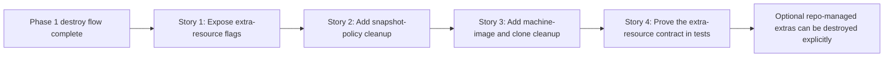

# Phase Contract: Phase 2 - Add Explicit Extra Resource Cleanup

**Date**: 2026-03-31
**Feature**: `openclaw-gcp-destroy-script`
**Phase Plan Reference**: `history/openclaw-gcp-destroy-script/phase-plan.md`
**Based on**:
- `history/openclaw-gcp-destroy-script/CONTEXT.md`
- `history/openclaw-gcp-destroy-script/discovery.md`
- `history/openclaw-gcp-destroy-script/approach.md`
- `history/openclaw-gcp-destroy-script/phase-1-contract.md`

---

## 1. What This Phase Changes

This phase lets operators widen the destroy command beyond the default VM/template/NAT/router stack when they need a fuller cleanup of repo-managed extras. After it lands, `destroy.sh` can include explicitly named snapshot-policy, machine-image, and clone-instance cleanup in the same dry-run plan and final summary, without discovering or guessing at any related resources on the operator's behalf.

---

## 2. Why This Phase Exists Now

- Phase 1 already proved the core destroy loop is safe enough to trust, so the next highest-value extension is covering the optional artifacts this repo can also create.
- These extra resources have different deletion semantics than the core stack, especially snapshot-policy detach behavior, so they deserve their own phase instead of being mixed into the original destructive rollout.
- If this phase were skipped, operators would still have to manually stitch together cleanup for backup and clone artifacts even though the repo already creates them through first-party helper scripts.

---

## 3. Entry State

- `scripts/openclaw-gcp/destroy.sh` already supports Phase 1 teardown for the standard stack with typed confirmation, qualification, deterministic ordering, and truthful mixed-success reporting.
- The repo already has create-side scripts for the relevant extra resources:
  - `scripts/openclaw-gcp/create-snapshot-policy.sh`
  - `scripts/openclaw-gcp/create-machine-image.sh`
  - `scripts/openclaw-gcp/spawn-from-image.sh`
- `tests/openclaw-gcp/test.sh` already covers the Phase 1 destroy contract and can be extended with extra-resource fixtures.

---

## 4. Exit State

- `scripts/openclaw-gcp/destroy.sh` accepts explicit extra-resource flags that widen the delete plan only when the operator names those targets directly:
  - snapshot policy name, plus optional explicit disk + disk-zone detachment context
  - machine image name
  - clone instance name, plus explicit clone zone when it differs from the core instance zone
- Dry-run and pre-delete summary output show extra resources only when the corresponding flags are present, and the command still remains exact-name only.
- Snapshot-policy cleanup is explicit and contract-bound:
  - if a target disk is supplied, the script verifies the named policy is attached to that exact disk before attempting a detach
  - if that predicate fails, the destroy flow stops before any extra-resource delete command runs and prints manual guidance
  - snapshot-policy cleanup runs before any instance deletion that could remove the named disk, so a standard boot-disk policy can still be verified and detached safely
- Machine-image cleanup and clone-instance cleanup remain exact-name only and avoid broad discovery:
  - machine images are described and deleted only by the explicitly supplied image name
  - clone instances are described and deleted only by the explicitly supplied instance name and zone
  - clone-instance cleanup reuses the one-disk `boot=true` + `autoDelete=true` guard before deletion so the command fails closed on obvious unexpected disk shapes
- The Phase 1 summary model expands cleanly to include extra resources, and mixed-success behavior still continues through later explicitly named deletes before exiting non-zero.
- Overall execution order is deterministic once extras are present:
  - snapshot-policy detach/delete first when supplied
  - core stack keeps the Phase 1 order: instance -> template -> NAT -> router
  - clone-instance cleanup runs after the core stack
  - machine-image cleanup runs last
- `tests/openclaw-gcp/test.sh` proves the Phase 2 contract, including flag parsing, dry-run rendering for extras, snapshot-policy attachment mismatch failures, clone safety failures, extra-resource delete ordering, and mixed-success reporting when extras are included.

**Rule:** every exit-state line above is demonstrable by a script run or test assertion.

---

## 5. Demo Walkthrough

An operator runs `bash scripts/openclaw-gcp/destroy.sh --project-id hoangnb-openclaw --dry-run --snapshot-policy-name oc-daily-snapshots --snapshot-policy-disk oc-main --snapshot-policy-disk-zone asia-southeast1-a --machine-image-name oc-main-pre-upgrade-20260331-0000 --clone-instance-name oc-main-recovery --clone-zone asia-southeast1-a` and sees the standard stack plus the explicitly named extras in one delete plan. They rerun for real, confirm the destructive token, and the script either removes the named extras alongside the core stack or exits non-zero with a per-resource summary that shows which optional resources still need manual cleanup.

### Demo Checklist

- [ ] Dry-run renders the core-stack plan plus only the explicitly named extra resources.
- [ ] A snapshot-policy detach path requires the exact disk and fails before extra deletion when the policy is not attached to that disk.
- [ ] A run that includes snapshot-policy cleanup against the standard boot disk performs the policy cleanup before deleting the core instance.
- [ ] A clone instance with an unexpected disk shape fails before clone deletion.
- [ ] Mixed-success extra-resource runs still attempt later explicitly named deletes and finish with a truthful summary.
- [ ] Phase 1 behavior remains intact when no extra-resource flags are passed.

---

## 6. Story Sequence At A Glance

| Story | What Happens | Why Now | Unlocks Next | Done Looks Like |
|-------|--------------|---------|--------------|-----------------|
| Story 1: Expose explicit extra-resource flags | The destroy command can express snapshot-policy, machine-image, and clone cleanup targets without changing the default Phase 1 behavior. | Operators need a stable surface for optional extras before delete logic or tests can grow safely. | Extra-resource qualification and execution can hang off a settled CLI contract. | Dry-run shows extra targets only when those flags are passed. |
| Story 2: Add snapshot-policy cleanup with explicit detachment rules | The command can detach a named policy from an explicitly named disk and then delete the policy, or fail with manual guidance if the attachment contract does not match. | Snapshot-policy cleanup has the most special-case behavior and needs its own guardrail before the wider extra teardown flow is believable. | Machine-image/clone cleanup can share the same mixed-summary model afterward. | A matched policy+disk pair can be detached and deleted; a mismatch fails before extra-resource deletion. |
| Story 3: Add machine-image and clone cleanup | The command can include explicitly named machine images and clone instances in the delete plan and final summary without broad discovery. | Once snapshot-policy handling is clear, the remaining extras are straightforward exact-name delete paths that should plug into the shared result model. | Tests can cover the full mixed-resource teardown story. | Machine-image and clone-instance deletes join the plan, summary, and mixed-failure flow cleanly. |
| Story 4: Prove the extra-resource contract in tests | The shell harness locks the extra-resource behavior into place so later phases can focus on docs rather than re-debugging teardown behavior. | The widened destructive surface needs automated protection before docs freeze the command examples. | Phase 3 docs and smoke examples can reference a stable final CLI surface. | `make test` catches regressions in extra flags, snapshot detach safety, clone safety, and mixed-resource summaries. |

---

## 7. Phase Diagram

---

## 8. Out Of Scope

- README and runbook updates remain Phase 3 work.
- Broad discovery of "related" backup or clone artifacts remains explicitly out of scope.
- Multi-clone bulk deletion or wildcard extra-resource cleanup remains out of scope.

---

## 9. Success Signals

- Operators can widen `destroy.sh` with named extra resources without weakening the default Phase 1 behavior.
- Snapshot-policy cleanup fails closed when the named policy/disk relationship does not match the explicit input.
- Snapshot-policy cleanup order is explicit enough that the command can still detach a policy from the standard boot disk before instance deletion removes that disk.
- Machine-image and clone cleanup remain exact-name only and produce the same truthful summary model as the core stack.
- The test suite proves mixed-success behavior across both core and optional resources.

---

## 10. Failure / Pivot Signals

- If snapshot-policy attachment cannot be checked reliably enough to support explicit detach semantics, validating should force a narrower contract before implementation.
- If clone-instance safety cannot be expressed with a clear no-guessing predicate, validating should narrow clone cleanup rather than bluff ownership.
- If the summary model becomes confusing once extras are mixed with core resources, execution should pause until the reporting contract is simplified.
