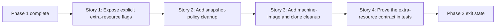

# Story Map: Phase 2 - Add Explicit Extra Resource Cleanup

**Date**: 2026-03-31
**Phase Plan**: `history/openclaw-gcp-destroy-script/phase-plan.md`
**Phase Contract**: `history/openclaw-gcp-destroy-script/phase-2-contract.md`
**Approach Reference**: `history/openclaw-gcp-destroy-script/approach.md`

---

## 1. Story Dependency Diagram

---

## 2. Story Table

| Story | What Happens In This Story | Why Now | Contributes To | Creates | Unlocks | Done Looks Like |
|-------|-----------------------------|---------|----------------|---------|---------|-----------------|
| Story 1: Expose explicit extra-resource flags | `destroy.sh` gains the explicit flags and dry-run/pre-delete plan surface for snapshot-policy, machine-image, and clone cleanup, while preserving the default Phase 1 behavior when those flags are omitted. | The optional cleanup surface needs a stable contract before deeper qualification and delete logic can be layered on. | Exit-state lines 1 and 2 | Extra-resource flag parsing, plan rendering, operator-facing summary shape, and deterministic extra-resource ordering | Story 2 can implement snapshot-policy cleanup behind the settled flag surface | A dry-run shows extra targets only when the operator names them explicitly and makes the extra-resource order obvious. |
| Story 2: Add snapshot-policy cleanup | The command can verify a named snapshot policy is attached to an explicitly named disk, detach it when requested, and delete the policy without guessing at any other attachments. | Snapshot-policy cleanup is the most specialized extra-resource path and needs explicit safety checks before other extras join the same flow. | Exit-state lines 2 and 3 | Snapshot-policy qualification, detach command rendering/execution, targeted failure guidance, and the pre-instance execution rule needed for boot-disk policies | Story 3 can add the remaining extra-resource deletes into the same summary model | A matched policy+disk pair can be detached and deleted before the core instance delete runs; a mismatch fails before any extra-resource delete command runs. |
| Story 3: Add machine-image and clone cleanup | The command can describe and delete explicitly named machine images and clone instances, and it folds those outcomes into the shared mixed-success summary. | Once the special snapshot-policy behavior is in place, the remaining explicit-name extras can be added in a more uniform way. | Exit-state lines 3 and 4 | Machine-image + clone cleanup flow, clone disk-safety guard reuse, deterministic post-core extra cleanup order, and expanded final summary coverage | Story 4 can lock the full Phase 2 behavior into tests | Operators can run one destroy command that cleans up named extras in a stable order and still get a truthful final summary. |
| Story 4: Prove the extra-resource contract in tests | The shell harness grows fixtures and assertions for extra flags, snapshot attachment mismatch, clone safety mismatch, and mixed-resource delete outcomes. | The widened destructive surface should be protected before docs start depending on it. | Exit-state line 5 | Extra-resource mock branches and regression coverage | Phase 3 docs can reference a stable command surface | `make test` fails if any extra-resource contract behavior regresses. |

---

## 3. Story Details

### Story 1: Expose explicit extra-resource flags

- **What Happens In This Story**: `destroy.sh` learns the explicit flag surface for optional extras, and its dry-run / plan summary expands to show those resources only when the operator names them.
- **What Happens In This Story**: `destroy.sh` learns the explicit flag surface for optional extras, and its dry-run / plan summary expands to show those resources only when the operator names them, in a deterministic order that later execution can reuse.
- **Why Now**: the later delete paths need one stable CLI contract and one stable summary model to plug into.
- **Contributes To**: exit-state lines 1 and 2.
- **Creates**: extra-resource parser behavior, summary rows for optional extras, and plan rendering for detachment + delete commands.
- **Creates**: extra-resource parser behavior, summary rows for optional extras, plan rendering for detachment + delete commands, and the deterministic extra-resource order.
- **Unlocks**: Story 2 can add real snapshot-policy cleanup without inventing its own mini CLI.
- **Done Looks Like**: the command can preview extra cleanup targets cleanly without changing the default standard-stack behavior.
- **Candidate Bead Themes**:
  - extend `destroy.sh` flag parsing and dry-run surface for optional extras
  - preserve backward-compatible Phase 1 behavior when extra flags are omitted

### Story 2: Add snapshot-policy cleanup

- **What Happens In This Story**: the command gains the explicit snapshot-policy cleanup path, including attachment verification against a named disk, detachment when required, and resource-policy deletion.
- **What Happens In This Story**: the command gains the explicit snapshot-policy cleanup path, including attachment verification against a named disk, detachment when required, and resource-policy deletion before any instance delete that could remove that disk.
- **Why Now**: snapshot-policy cleanup has attachment-specific behavior that needs a strong contract before the rest of the extra-resource flow is believable.
- **Contributes To**: exit-state lines 2 and 3.
- **Creates**: attachment verification, optional detach-before-delete sequencing, and predicate-specific manual guidance.
- **Unlocks**: Story 3 can add the simpler extra-resource delete paths into the same result collection model.
- **Done Looks Like**: a correct policy/disk pair succeeds, and attachment mismatch fixtures fail closed before extra deletion begins.
- **Done Looks Like**: a correct policy/disk pair succeeds before the core instance delete can remove the disk, and attachment mismatch fixtures fail closed before extra deletion begins.
- **Candidate Bead Themes**:
  - spike and then implement explicit policy attachment verification against disk describe output
  - implement detach + delete sequencing with no broad discovery

### Story 3: Add machine-image and clone cleanup

- **What Happens In This Story**: the command can include machine images and clone instances in the same delete run, describing and deleting only the explicitly named resources and reusing the one-disk safety gate for clone instances.
- **What Happens In This Story**: the command can include machine images and clone instances in the same delete run, describing and deleting only the explicitly named resources, reusing the one-disk safety gate for clone instances, and fitting both resources into the deterministic order established earlier in the phase.
- **Why Now**: after snapshot-policy behavior is settled, the remaining extras are mainly about integrating new exact-name resource types into the existing summary and failure model.
- **Contributes To**: exit-state lines 3 and 4.
- **Creates**: extra-resource describe/delete paths, clone guard reuse, and deterministic extra-resource ordering in the result collector.
- **Unlocks**: Story 4 can verify the full mixed-resource operator story.
- **Done Looks Like**: machine-image and clone cleanup work with the same dry-run, mixed-success, and manual-cleanup semantics as the rest of the destroy flow.
- **Done Looks Like**: machine-image and clone cleanup work with the same dry-run, mixed-success, manual-cleanup semantics, and deterministic order as the rest of the destroy flow.
- **Candidate Bead Themes**:
  - spike and then define the safest exact-name contract for machine-image + clone cleanup
  - wire machine-image and clone outcomes into the shared result summary

### Story 4: Prove the extra-resource contract in tests

- **What Happens In This Story**: the shell harness is extended so the extra-resource contract cannot regress silently.
- **What Happens In This Story**: the shell harness is extended so the extra-resource contract cannot regress silently, including the order constraint that snapshot-policy cleanup must happen before boot-disk instance deletion.
- **Why Now**: docs should not depend on the widened command surface until its failure paths and mixed-success behavior are automated.
- **Contributes To**: exit-state line 5.
- **Creates**: extra-resource mock `gcloud` branches, delete-order assertions, and explicit mismatch fixtures.
- **Unlocks**: Phase 3 docs and smoke examples.
- **Done Looks Like**: `make test` proves the widened destroy contract and still protects the original Phase 1 behaviors.
- **Candidate Bead Themes**:
  - extend the mock harness for resource-policy detach/delete, machine-image delete, and clone-instance describe/delete
  - add extra-resource success/failure fixtures while preserving Phase 1 assertions

---

## 4. Story Order Check

- [x] Story 1 is obviously first
- [x] Every later story builds on or de-risks an earlier story
- [x] If every story reaches "Done Looks Like", the phase exit state should be true

---

## 5. Story-To-Bead Mapping

> Fill this in after bead creation so validating and swarming can see how the narrative maps to executable work.

| Story | Beads | Notes |
|-------|-------|-------|
| Story 1: Expose explicit extra-resource flags | `br-2zs` | Establishes the Phase 2 CLI surface without weakening Phase 1 defaults |
| Story 2: Add snapshot-policy cleanup | `br-1ho`, `br-3p3` | Spike `br-1ho` validates the detach/ownership contract before implementation `br-3p3` |
| Story 3: Add machine-image and clone cleanup | `br-322`, `br-32o` | Spike `br-322` locks the safest cleanup contract before implementation `br-32o` |
| Story 4: Prove the extra-resource contract in tests | `br-89e` | Protects both new extra-resource behavior and existing core destroy behavior |
