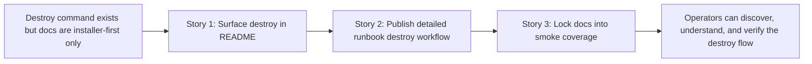

# Phase Contract: Phase 3 - Publish The Teardown Story

**Date**: 2026-03-31
**Feature**: `openclaw-gcp-destroy-script`
**Phase Plan Reference**: `history/openclaw-gcp-destroy-script/phase-plan.md`
**Based on**:
- `history/openclaw-gcp-destroy-script/CONTEXT.md`
- `history/openclaw-gcp-destroy-script/discovery.md`
- `history/openclaw-gcp-destroy-script/approach.md`
- `history/openclaw-gcp-destroy-script/phase-1-contract.md`
- `history/openclaw-gcp-destroy-script/phase-2-contract.md`

---

## 1. What This Phase Changes

This phase makes the destroy flow discoverable and trustworthy for a normal operator. After it lands, someone reading the repo's main README or the OpenClaw GCP runbook can find the destroy companion command, understand when to use `--dry-run` versus a real run, see the exact extra-resource flags that remain explicit-name only, and copy documented examples that are protected by the shell test suite.

---

## 2. Why This Phase Exists Now

- The command surface is now stable enough to document because both the core destroy path and the explicit extra-resource path are implemented and covered by tests.
- Docs should come after the delete contract settles; otherwise README and runbook examples would freeze behavior that was still moving.
- If this phase were skipped, the repo would have a working destroy flow that only people who already know the code could discover and trust.

---

## 3. Entry State

- `scripts/openclaw-gcp/destroy.sh` exists and covers both the standard stack and explicit Phase 2 extra resources.
- `tests/openclaw-gcp/test.sh` already verifies destroy behavior directly, but the repo docs do not yet present the destroy companion flow as part of the operator story.
- `README.md` and `docs/openclaw-gcp/README.md` are still installer-first only, with no destroy walkthrough or copy-paste destroy examples.

---

## 4. Exit State

- `README.md` surfaces the destroy companion flow beside the installer-first primary path, including when an operator should use it and a copy-paste dry-run example.
- `docs/openclaw-gcp/README.md` explains the destroy workflow in practical operator language:
  - exact-name safety boundary
  - typed confirmation versus `--yes`
  - dry-run usage
  - explicit extra-resource cleanup flags
  - partial-failure summary expectations and where to look next
- The documented destroy examples in both docs surfaces are protected by the shell test suite so future edits cannot silently drift away from the actual CLI contract.
- The smoke coverage stays contract-bound:
  - documented examples parse in dry-run mode
  - the docs-smoke additions do not weaken existing installer or destroy assertions
  - examples remain explicit-name only and do not introduce broad discovery language

**Rule:** every exit-state line above is demonstrable by a doc read or test assertion.

---

## 5. Demo Walkthrough

A new operator lands on the repo, sees in `README.md` that there is a destroy companion for the installer flow, clicks into the OpenClaw GCP runbook, and finds a dry-run destroy example plus a real-run explanation with typed confirmation and optional extra-resource flags. The same documented examples are then proven by `bash tests/openclaw-gcp/test.sh`, which confirms that the README and runbook commands still parse against the actual CLI surface.

### Demo Checklist

- [ ] The root README mentions the destroy companion flow near the main operator story.
- [ ] The runbook explains the destroy path clearly enough for someone who has not read the script.
- [ ] The docs examples use the real destroy flag surface, including explicit-name-only extra cleanup.
- [ ] The docs-smoke tests fail if a documented destroy example stops parsing.

---

## 6. Story Sequence At A Glance

| Story | What Happens | Why Now | Unlocks Next | Done Looks Like |
|-------|--------------|---------|--------------|-----------------|
| Story 1: Surface the destroy companion in the root README | The repo's top-level story stops being install-only and explicitly tells operators there is a safe destroy companion with dry-run support. | Operators should discover the destroy command from the first page they read before diving into deeper runbook detail. | The runbook can expand that short README mention into full operator guidance. | A reader of `README.md` can tell that destroy is part of the supported day-2 flow. |
| Story 2: Publish the detailed runbook destroy workflow | The OpenClaw GCP runbook explains destroy usage, flags, confirmation, extras, and failure behavior in practical terms. | Once the README points to destroy, the runbook needs to answer the operator's next questions without forcing script spelunking. | The documented commands can be frozen into smoke coverage. | A cautious operator can follow the runbook to run a destroy dry-run and understand the real-run guardrails. |
| Story 3: Lock the docs into smoke coverage | The test suite protects the documented destroy examples so the docs cannot silently drift from the command contract. | Docs are only believable when the examples are kept live. | Review and merge can treat the operator story as stable. | `bash tests/openclaw-gcp/test.sh` fails if a documented destroy example or its contract language drifts. |

---

## 7. Phase Diagram

---

## 8. Out Of Scope

- Any new destroy behavior or CLI flags are out of scope for this phase.
- Broad operational guidance beyond the destroy companion flow remains out of scope.
- Review/merge work remains after this phase.

---

## 9. Success Signals

- A first-time operator can discover the destroy command from repo docs without reading implementation files.
- The runbook explains the exact-name safety contract, dry-run path, and partial-failure expectations plainly.
- README and runbook examples remain aligned with the actual Phase 2 CLI surface.
- Docs-smoke coverage protects the published destroy examples.

---

## 10. Failure / Pivot Signals

- If the docs cannot explain the destroy flow without reinterpreting the implemented contract, the phase should stop and re-check the command surface instead of papering over it.
- If the documented examples need brittle test exceptions to pass, the phase should simplify the examples rather than weaken smoke coverage.
- If README and runbook guidance diverge on safety boundaries or extra-resource behavior, the docs should be reconciled before validating.
