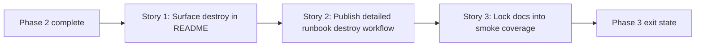

# Story Map: Phase 3 - Publish The Teardown Story

**Date**: 2026-03-31
**Phase Plan**: `history/openclaw-gcp-destroy-script/phase-plan.md`
**Phase Contract**: `history/openclaw-gcp-destroy-script/phase-3-contract.md`
**Approach Reference**: `history/openclaw-gcp-destroy-script/approach.md`

---

## 1. Story Dependency Diagram

---

## 2. Story Table

| Story | What Happens In This Story | Why Now | Contributes To | Creates | Unlocks | Done Looks Like |
|-------|-----------------------------|---------|----------------|---------|---------|-----------------|
| Story 1: Surface the destroy companion in the root README | The top-level README mentions the destroy companion flow, when to use it, and where to find deeper guidance. | The repo landing page should be the first place an operator discovers destroy support. | Exit-state line 1 | README destroy callout, concise dry-run example, and link path into the runbook | Story 2 can expand the short README mention into full operator instructions | A new reader can tell that install and destroy are both supported operator paths |
| Story 2: Publish the detailed runbook destroy workflow | The OpenClaw GCP runbook documents destroy usage, flags, dry-run, confirmation, explicit extra cleanup, and failure expectations. | Once README points people to destroy, the detailed operator instructions need to exist in one place. | Exit-state lines 1 and 2 | Runbook destroy section and concrete examples aligned to the implemented CLI | Story 3 can freeze those examples into docs-smoke tests | A cautious operator can follow the runbook without reading the script |
| Story 3: Lock the docs into smoke coverage | The shell suite parses the published destroy examples and protects the docs language against CLI drift. | Docs are only trustworthy if their examples stay live. | Exit-state lines 3 and 4 | README/runbook destroy example smoke tests | Review and merge can rely on the published operator story | `bash tests/openclaw-gcp/test.sh` fails if the documented destroy examples drift |

---

## 3. Story Details

### Story 1: Surface the destroy companion in the root README

- **What Happens In This Story**: `README.md` adds a short destroy companion section near the primary operator story so readers can discover teardown support without scanning the scripts directory.
- **Why Now**: this needs to happen before deeper runbook detail so the repo landing page does not hide the feature.
- **Contributes To**: exit-state line 1.
- **Creates**: README discoverability, concise destroy framing, and the first copy-paste destroy dry-run example.
- **Unlocks**: Story 2 can expand that short mention into full operator guidance.
- **Done Looks Like**: a new operator reading `README.md` can immediately tell where the destroy flow lives and how to preview it safely.
- **Candidate Bead Themes**:
  - update `README.md` to position destroy as the supported teardown companion

### Story 2: Publish the detailed runbook destroy workflow

- **What Happens In This Story**: `docs/openclaw-gcp/README.md` gains the practical destroy workflow: exact-name safety, dry-run and real-run behavior, explicit extra-resource flags, and failure-summary guidance.
- **Why Now**: after the README points to destroy, the runbook should answer the operator's next-level questions in one place.
- **Contributes To**: exit-state lines 1 and 2.
- **Creates**: detailed destroy instructions, example commands, and operator-facing recovery guidance.
- **Unlocks**: Story 3 can freeze the published examples into smoke coverage.
- **Done Looks Like**: the runbook is sufficient for a cautious operator to run a destroy dry-run and understand the real-run guardrails.
- **Candidate Bead Themes**:
  - update `docs/openclaw-gcp/README.md` with destroy workflow and examples

### Story 3: Lock the docs into smoke coverage

- **What Happens In This Story**: `tests/openclaw-gcp/test.sh` adds docs-smoke fixtures for the published destroy examples so CLI drift breaks tests instead of silently shipping stale docs.
- **Why Now**: the examples should only be frozen after the README and runbook text is settled.
- **Contributes To**: exit-state lines 3 and 4.
- **Creates**: destroy-specific docs-smoke assertions and future regression protection.
- **Unlocks**: review can treat the operator story as stable and test-backed.
- **Done Looks Like**: the docs examples are exercised alongside the rest of the shell suite and fail fast if the docs stop matching the CLI.
- **Candidate Bead Themes**:
  - extend `tests/openclaw-gcp/test.sh` with README/runbook destroy example parsing

---

## 4. Story Order Check

- [x] Story 1 is obviously first
- [x] Every later story builds on or de-risks an earlier story
- [x] If every story reaches "Done Looks Like", the phase exit state should be true

---

## 5. Story-To-Bead Mapping

> Fill this in after bead creation so validating and swarming can see how the narrative maps to executable work.

| Story | Beads | Notes |
|-------|-------|-------|
| Story 1: Surface the destroy companion in the root README | `br-1nk` | Adds top-level discoverability for the destroy flow |
| Story 2: Publish the detailed runbook destroy workflow | `br-10u` | Adds the full operator destroy guidance |
| Story 3: Lock the docs into smoke coverage | `br-29r` | Protects the published examples from drifting |
